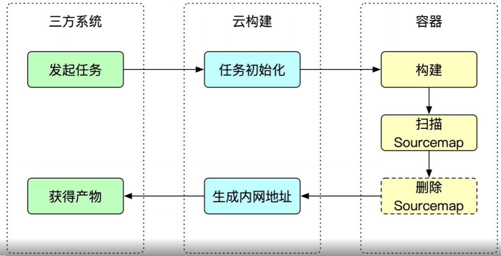
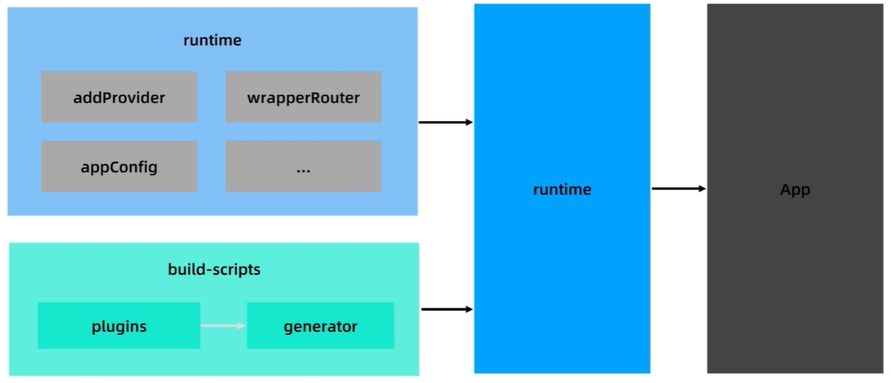
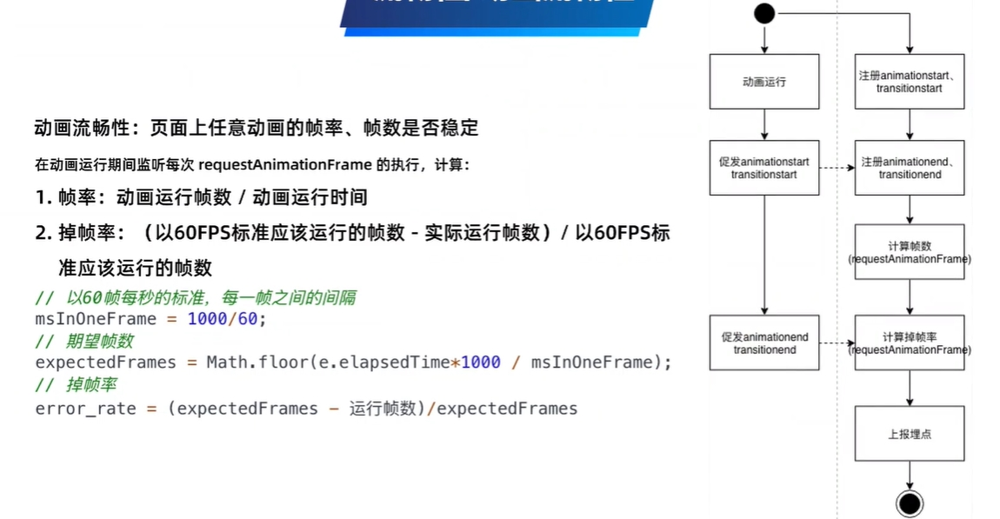
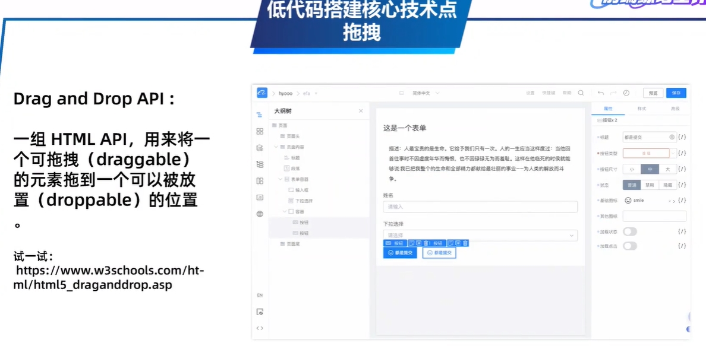

## 阿里巴巴前端练习生计划-第二天

### 潕量: Web 前端简介

**b 端 C 端**

B 端：企业商家，中后台，ui 交互相对固定

C 端：个人用户，变化，创意

**传统项目上线阶段**


所以这个主要就是讲中后台 😂

**推荐学习资料**

- webpack 官网 demo https://webpack.js.org/
- Fusion Design Pro 示例项目 https://fusion.design/mc/detail/728#/dashboard/analysis

作业：

先把今天课程的项目 clone 下来

`git clone https://github.com/bindoon/mid-practice.git`

然后这个视频要用的是`first`这个项目

作业 1：

- 深入 webpack loader @alifd/next-theme-loader 的工作原理，通过 webpack 配置的方式，把导航的背景色改成橙色 #FF6A00 (@alifd/next-theme-loader 地址 https://github.com/alibaba-fusion/next-theme-loader）
- 作业 2：
  - 修改 webpack 配置，npm run build 后让 build/pages/ 目录的 js 不被压缩（代码可读）。
  - 并且通过修改编译后 JS 代码 build/pages/index.js，在文字后面手动添加一个 button 按钮，如右图所示

先看作业一，这个还是比较简单的，配置下 webpack 就可以了，刚开始不知道怎么做，然后去看了看 Fusion Design 的官网，知道了如何配置来完成整作业

官网给的是这样的

```js {14-19}
{
                test: /\.scss$/,
                use: ExtractTextPlugin.extract({
                    use: [
                        'css-loader',
                        'fast-sass-loader',
                        {
                            // 添加 @alifd/next-theme-loader，引入自定义主题样式对应的 scss 变量
                            loader: '@alifd/next-theme-loader',
                            options: {
                                theme: '@alifd/theme-xxx',
                                // 基准包，默认是@alifd/next
                                base: '@alifd/next',
                                // 注入变量，来编译组件样式
                                // 支持 Object 和 String ， 如果是 String 请写绝对路径 例如: modifyVars: path.join(__dirname, 'variable.scss')
                                // 以下为Object
                                modifyVars: {
                                    '$css-prefix': '"myprefix-"', // 默认为 "next-"。如需自定义css前缀，再修改此处
                                },
                            },
                        },
                    ],
                }),
            },
```

有了上面那段代码的说明，这个作业一就完成了

```js {16-18}
{
          test: /\.s[ac]ss$/i,
          use: [
            // Creates `style` nodes from JS strings
            'style-loader',
            // Translates CSS into CommonJS
            'css-loader',
            // Compiles Sass to CSS
            'sass-loader',
            // 主题
            {
              loader: '@alifd/next-theme-loader',
              options: {
                theme: '@alifd/theme-2',
                // TODO
                modifyVars: {
                  '$my': '#FF704F',
                },
              },
            },
          ],
        },
```

然后用自己定义的这个变量替换 header 组件的`index.scss`文件的`$color-brand1-9`变量就可以了,效果如下


然后是作业二，第一个要求是让 js 不被压缩（代码可读），这个我首先想到的修改 webpack 的模式，这样 js 代码就不会压缩了,项目中也写有开发模式下的配置

```js
if (argv.mode === "development") {
  config.devtool = "source-map";
  console.log("1111111111111");
  // 开发环境本地 web 服务
  config.devServer = {
    headers: {
      "Access-Control-Allow-Origin": "*",
      "Access-Control-Allow-Credentials": "true",
    },
    stats: {
      chunks: false,
      children: false,
      modules: false,
      chunkModules: false,
    },
  };
}
if (argv.mode === "production") {
  // ...
}
```

但还提供了生产环境下的条件语句，况且以开发模式打包，打包后的文件里是无法完成第二个要求的，想了想，还是得在生产模式下取消代码的压缩，想到 webpack4.0 的 optimization，这就好办了，直接配置

```js
optimization: {
  minimize: false;
}
```

我直接在 config 里配置了，反正走开发环境也不会压缩 🙄

这样打包之后的代码就不会压缩了的，嘿嘿嘿，第一个要求完成了

可以打包后的文件里找到对应文字文件位置

```js
createClass(Index, [
  {
    key: "render",
    value: function render() {
      return _react2.default.createElement(
        "div",
        { className: "home-page" },
        _react2.default.createElement(
          "div",
          { className: "big-text" },
          "\u8FD9\u91CC\u53EF\u4EE5\u662F\u6574\u7AD9\u7684\u9996\u9875\uFF0C\u4E00\u4E2A\u5E26layout\u7684\u72EC\u7ACB\u9875\u9762\u3002"
        )
      );
    },
  },
]);
```

汉子似乎被转码了，这个影响不大，第二个要求是加一个 button，似乎是要写 creatElement 里的内容，但是汉字转码····，看我操作

1. jsx 文件里直接加 Button 组件
2. 打包
3. 在打包后的文件里找到刚刚添加的 Button

```jsx
react2.default.createElement(
  _next.Button,
  null,
  "\u8FD9\u662F\u901A\u8FC7\u76F4\u63A5\u4FEE\u6539\u7684webpack\u7F16\u8BD1\u6587\u4EF6\u7684 build/pages/index.js \u6DFB\u52A0\u7684"
);
```

4. 删除 jsx 里的 Button（好像什么都没发生过一样）
5. 重新进行打包
6. 将上面代码粘贴到打包后的文件的对应位置
7. 起一个服务，可以看到按钮被成功添加


这样子作业就完成 😁😁😁

### 龙魂： 跟我一起学 Git

这个直接放图


### 姬无：浅谈前端规范

**为什么我们需要前端规范**


**前端规范及配套工具**


**当研发流程遇上前端规范**


### 穹心：初识 Node.js


### 玄扈：Web 框架

MDN HTTP 入门: https://developer.mozilla.org/zh-CN/docs/Web/HTTP

koa-static: https://github.com/koajs/static

### 冬鸫：如何打造一套构建服务系统

构建指的是：构建过程，构建工具和生态，构建工具集成，构建服务环境

#### **前端云构建**


**云构建好处**


#### **构建器与构建命令**


**构建器及其服务**

构建器完成了构建逻辑与代码逻辑的解耦


**版本控制与灰度**


**依赖分离**


构建器缓存带来的构建时长减少 10%~50%

#### **构建通用服务**

**Sourcemap 提取**



**构建依赖记录与分析**


#### 任务调度系统


**任务调度流程**


#### 前端工程体系


### 鲲尘：如何打造统一工程构建基座

#### 工程构建的演进


#### 工程架构设计


#### 工程生态





##### 总结回顾


### 流司：打造愉快地前端应用研发体验

#### 脚手架

脚手架是一组最佳实践集合的及触摸板，能够让你快速启动项目而不用关心复杂的配置


#### 模块化 & 组件化

为什么需要模块化：命名冲突，逻辑混杂，依赖混乱

有了模块化分治能力之后，是不是按照 UI 组件的维度来开发项目呢？


### 由校：实现一个监控系统


#### 体验监控系统包含哪些方面


**稳定性/脚本异常**


**稳定性/接口异常**


\***\*稳定性/资源异常**


**稳定性/白屏**


**稳定性/Crash**


**流畅性/加载性能**


**流畅性/操作流畅性**





**上报方案**


### 无曰：低代码技术入门

#### 低代码的概念及价值

价值：

- 提高研发效率，，交付速度
- 降低研发门槛
- 保障应用品质


#### 低代码的实现原理





#### 阿里低代码引擎


### 自羽：微前端

#### 微前端价值


#### 微前端方案

Single-spa,qiankun,iceStark


#### 架构及核心实现

